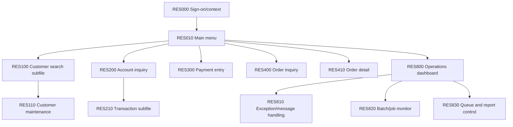

# Interactive, batch, messaging and operations architecture

## 5250 application map

DSPFs use named record formats, command keys, indicators, input-capable fields, message subfiles, window formats, load-all and expandable subfiles where each is realistic. Search and transaction lists paginate by stable key; inquiry and update modes have distinct authority. Screen programs call shared/domain service programs and do not embed all business logic. Error messages retain message ID/help; optimistic update or record locks prevent lost changes. The dashboard correlates batch runs, jobs, MSGW, queues, exceptions and spool without impersonating QSYSOPR.

## Batch graph

Daily intake validates partner files, then customer/account/payment/order work proceeds concurrently where dependencies permit. EOD freezes a business-date boundary, drains/records inbound work, posts subledgers, reconciles payments and inventory, posts GL, generates statements/reports, archives transmissions, advances the business date and releases the next cycle. Month/year close extend the same run-control graph with period balances, retained history and regulatory reports.

Every step has a CLLE entry command, declared JOBD/JOBQ/SBSD routing, input boundary, checkpoint, job correlation, completion/diagnostic/escape messages, expected spool, restart class and cleanup. Rerun is `resume`, `replay-idempotent`, `compensate`, or `manual`; “run it again” is not a policy. Submitted children and grandchildren remain related to the batch run even across job boundaries.

## Operator intervention

Recoverable exceptions create a durable exception row plus diagnostic message. Cases requiring a business decision send an inquiry to `RESOPR`, enter observable MSGW, accept a controlled reply, record responder/correlation, and continue, retry, skip or roll back. Unanswered inquiries time out into a held/manual state. Informational, completion, diagnostic, escape, status, notify, request, inquiry and reply messages each have declared use; message types are not interchanged merely for coverage.
