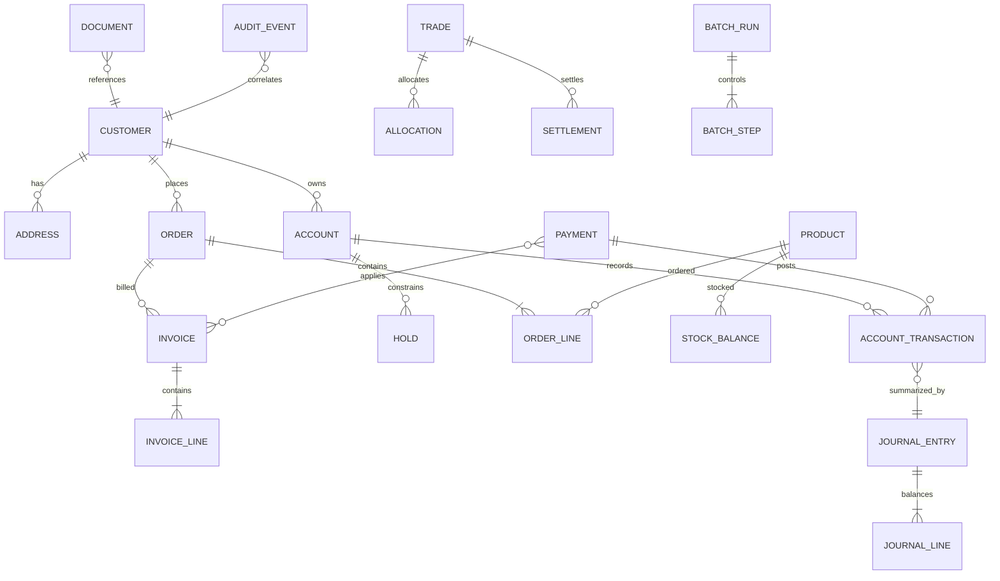

# Business domains and component architecture

The machine authority is `registry/estate/components.json`; this narrative explains bounded contexts.

| Domain | Responsibilities | Representative components | Natural IBM i emphasis |
|---|---|---|---|
| Foundation | configuration, reference data, business calendars, numbering, validation, errors, audit correlation | configuration service, calendar service, numbering service, common ILE services | DTAARA, SQL sequences, MSGF, *SRVPGM, *BNDDIR |
| Customer | master, addresses, contacts, relationships, status/history, preferences, document links, search | customer maintenance, keyed lookup, search service | DDS PF/LF, native I/O, subfiles, history journal |
| Accounts | products/types, lifecycle, balances, holds, transactions, adjustments | account service, balance service, transaction history | commitment control, locks, native I/O and SQL |
| Payments | entry, validation, authorization, posting, reversal, return, exception, reconciliation, notification | payment orchestrator, posting service, notification publisher | SQLRPGLE, journaled transactions, DTAQ |
| Orders | capture, lines, pricing, status, fulfillment, cancellation, returns | order service, pricing engine, fulfillment coordinator | service programs, SQL, async jobs |
| Inventory | items, locations, stock, reservations, movements, replenishment | stock service, reservation worker | locking, optimistic checks, batch replenishment |
| Billing | invoices, charges, credits, payment application, aging, collections | invoice engine, cash application, collections queue | SQL procedures, batch, spool notices |
| Accounting | chart, journals, GL/subledgers, reconciliation, periods, adjustments | legacy ledger core, posting gateway, close manager | RPG IV, COBOL, DDS/SQL mix, journals |
| Trading | orders, trades, allocations, confirms, settlement, positions, exceptions | trade capture, allocation engine, settlement worker | COBOL, high-priority batch, dense decimal data |
| Reporting | statements, operational/financial/audit reports, exports and archive | statement generator, print router, report archive | PRTF, spool, OUTQ, IFS PDF/text artifacts |
| Batch | schedules, dependencies, run control, checkpoints, reruns, partial failure | batch controller, EOD graph, restart manager | CLLE, SBMJOB, JOBQ/JOBD/SBSD |
| Operations | monitoring, queue control, messages, exceptions, recovery, deployment | operator console, queue monitor, recovery commands | DSPF, MSGQ, MSGW, commands, SQL Services |
| Security | application users/roles, SoD, privileged operations and authority tests | authorization service, privileged command gateway | USRPRF, AUTL, adopted authority, auditing |
| Documents | inbound/outbound/archive, validation, transformation, transfer | intake service, archive service, export builder | IFS, CCSID conversion, QShell/PASE |
| Integration | MQ, HTTP, SOAP, file transfer, sockets, mail, databases | gateway services, adapters, outbox/inbox | DTAQ, Java, C sockets, JDBC/ODBC |

Components expose declared interfaces. Cross-domain writes go through an owning service except for registered legacy exceptions. The limited trading domain provides demanding volumes, settlement and decimal behavior but is not required for customer/order/payment operation.

## Domain relationship model

Operational entities—outbox/inbox message, exception, idempotency key, job correlation, report run, document manifest, interface transmission, and audit event—connect workflows without hiding state in process memory.
