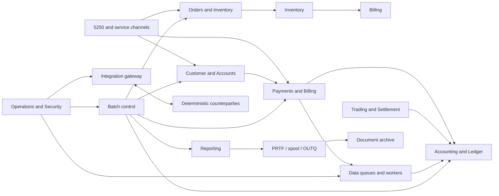

# RES system blueprint

## Mission and boundaries

The Reference Enterprise System (RES) is one deliberately complicated fictional enterprise that sells products and services, maintains customer and financial accounts, accepts payments and orders, holds inventory, bills customers, posts a general ledger, performs a bounded securities-processing line of business, produces regulated reports, and exchanges documents with partners. It is designed to have accumulated multiple IBM i generations while remaining operable as one estate. It is not the Modernizer, a language gallery, or a completeness claim.

RES has two non-substitutable layers:

1. **Layer A — enterprise application.** Long-lived business records and workflows cross domain boundaries, jobs, queues, reports, security contexts, and external contracts. Golden end-to-end acceptance proves that the estate works coherently.
2. **Layer B — semantic behavior corpus.** Atomic, negative, interaction, concurrency, recovery, security, and lifecycle cases establish exact platform behavior. Every supported case declares one placement: `business_integrated`, `operations_integrated`, or `semantic_edge`. Edge cases use the shared lab and estate vocabulary without deforming production workflows.

A semantic case traces through a capability allocation to a component and workflow; a workflow traces back through capabilities and cases to evidence. Design catalogs are planning authority; the coverage registry and authoritative evidence remain behavioral authority.

## Architectural shape

Domain ownership is explicit, but integration occurs through stable service procedures, program interfaces, commands, queues, messages, shared identifiers, and declared database contracts. Direct shared-file access exists only where intentional legacy realism requires it and is recorded in the dependency graph.

## Generational architecture

* **Foundation and modern payments:** free-form ILE RPG and SQLRPGLE expose typed procedures and transactional SQL because these areas represent active modernization on IBM i.
* **Customer and account core:** RPG IV/ILE RPG with native I/O plus selected SQL reflects gradual evolution and gives keyed access, access-path, record-lock, override, and member semantics a genuine home.
* **Accounting:** fixed-format RPG IV and ILE/SQL COBOL coexist around stable files because a mature ledger changes conservatively. New posting APIs wrap rather than erase legacy programs.
* **Batch and operations:** CL/CLLE own orchestration, overrides, library lists, job submission, messages, restart controls, and commands—the work CL naturally performs.
* **High-volume settlement/import:** ILE COBOL and SQL COBOL handle record-oriented feeds and reconciliation; they are not decorative ports.
* **Low-level integration and APIs:** C/C++ handle sockets, binary structures, system APIs, user spaces and queues where low-level control is justified.
* **Partner channels:** Java handles long-lived HTTP/SOAP/JDBC services where JVM ecosystem facilities are natural.
* **File automation:** QShell/PASE utilities perform archive, checksum, compression, text conversion, and transfer staging. REXX supplies operator diagnostics and controlled ad-hoc administration. SQL routines centralize set-oriented validation and reporting functions.
* **Historical corner:** a bounded, documented set of older RPG-compatible sources, generated code, and near-duplicates preserves discoverable historical patterns without making them the default.

## Scale and partitioning

Catalogs are sharded by stable IDs and domain when growth demands it; validators consume all shards. Components, workflows, capabilities, build DAG nodes, dependency nodes, and semantic IDs are independent namespaces. No design relies on directory order. Libraries and source trees can grow to thousands of objects/programs, and evidence remains external/content-addressed. Data partitioning uses business keys, dates, members, and archive libraries where the workflow warrants it—not artificial one-case databases.

## Invariants

* One business identifier vocabulary and business calendar span all domains.
* Financial mutations are journaled, balanced, idempotent where externally initiated, and reconcilable.
* Every asynchronous request has correlation, durable state, retry classification, poison handling, and operator visibility.
* Every batch unit records run, step, checkpoint, input boundary, disposition, and restart decision.
* Every external interaction is an IBM i behavior observation plus a separate counterparty contract observation.
* Every intentional legacy hazard is registered, owned, testable, and prohibited from spreading accidentally.
* No source or design record implies IBM i verification until Behavior Lab evidence proves it.
